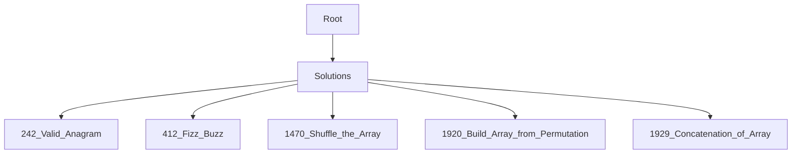

# 🚀 LeetCode Solutions

A collection of clean, efficient, and well-documented LeetCode solutions implemented in **C#**.

## 📂 Solutions

| # | Title | Difficulty | Solution |
|---|---|---|---|
| 242 | [Valid Anagram](https://leetcode.com/problems/valid-anagram/) |  | [Solution](Solutions/242.%20Valid%20Anagram) |
| 412 | [Fizz Buzz](https://leetcode.com/problems/fizz-buzz/) |  | [Solution](Solutions/412.%20Fizz%20Buzz) |
| 1470 | [Shuffle the Array](https://leetcode.com/problems/shuffle-the-array/) |  | [Solution](Solutions/1470.%20Shuffle%20the%20Array) |
| 1920 | [Build Array from Permutation](https://leetcode.com/problems/build-array-from-permutation/) |  | [Solution](Solutions/1920.%20Build%20Array%20from%20Permutation) |
| 1929 | [Concatenation of Array](https://leetcode.com/problems/concatenation-of-array/) |  | [Solution](Solutions/1929.%20Concatenation%20of%20Array) |

## 🏗 Project Structure

## 👤 Author

**Omer Faruk Ozer**

- Github: [@omerozerf](https://github.com/omerozerf)
